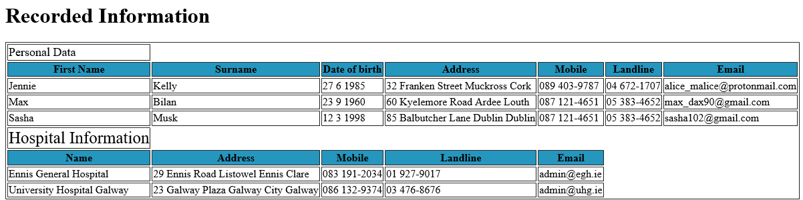

# Hospital-Employees

The First objective was to create a DTD to describe an XML vocabulary, a record employees and hospitals.

The Second objective was to create an XSD of the DTD

The Final objective was to create an XSLT to transform documents from the XSD into HTML

### Result in the browser

